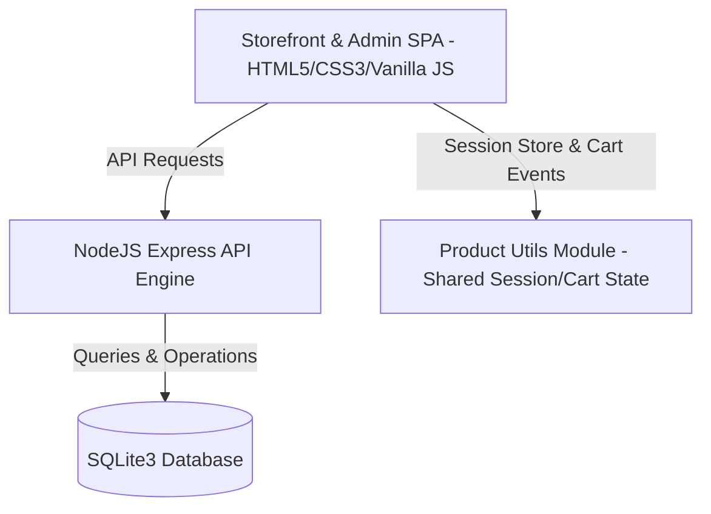

<div align="center">
  
  # ⚡ WILD SAALA
  
  ### *Not Just a Hoodie. A Wild Statement.*
  
  An ultra-premium, dark-themed, open-source streetwear e-commerce platform and analytics dashboard built for high-performance scale and seamless developer configuration.

  [](LICENSE)
  [](https://nodejs.org)
  [](#architecture)
  [](#design-aesthetics)

  <p align="center">
    <a href="#key-features">Key Features</a> •
    <a href="#architecture">Architecture</a> •
    <a href="#quick-start">Quick Start</a> •
    <a href="#api-documentation">API Docs</a> •
    <a href="#roadmap">Roadmap</a> •
    <a href="#contributing">Contributing</a>
  </p>


</div>
---

## 📖 About & Project Overview

**Wild Saala** is a premium, high-performance e-commerce platform and business intelligence ecosystem specifically optimized for modern streetwear brands. Combining a high-end minimalist dark theme with robust backend mechanics, it delivers an enterprise-grade digital storefront experience with zero third-party framework overhead.

### 🌟 Core Specialities & Capabilities

* **Modern Design Aesthetics**: A gorgeous dark UI featuring glassmorphism, responsive navigation grids, and interactive micro-animations that respond fluidly to user events.
* **Indian Market Localization**: Built-in validations for state-level select menus and strict 6-digit PIN code numeric validations, ensuring high-fidelity delivery mapping.
* **Full-Stack Autonomy**: A clean architecture decoupling the presentation layer from the Node.js Express server and SQLite3 database instance.
* **Invisible Signature Watermarking**: Built-in codebase verification containing authorship data embedded cleanly within script headers.

### ⚙️ Functional Features

1. **Inventory System**: Multi-dimensional variant mapper linking sizes and colors to dynamic stock levels with automatic "Sold Out" badge triggers.
2. **Cart Persistence**: Native client-side state storage ensuring user shopping carts persist across page transitions and browser reloads.
3. **Coupon Engine**: Custom discount validator supporting specialized prepaid coupon keys (e.g. `WD20`) that dynamically invalidate if checkout settings are changed to Cash on Delivery (COD).
4. **Order Management**: End-to-end transactional storage logging detailed order details, customer addresses, payment methods, and fulfillment states.
5. **Analytics Suite**: Admin-facing data visualization tracking total revenue, live order counts, category distribution, and email waitlists.
6. **Payment & Checkout Flow**: Guided multi-step checkout with instant address validation and layout responsiveness.
7. **Authentication Check**: Seamless customer checking utilizing cached local storage variables to pre-fill active user sessions.
8. **Real-time Updates**: Interactive search query filtering, category dropdown sorting, and live active filter chip updates on the storefront.
9. **Performance Optimization**: Ultra-fast page speed index achieved via lightweight vanilla code execution and indexed SQL queries.

---


## 📈 Key Metrics & Architecture

* **Performance first**: Zero large framework bloat. Pure vanilla HTML5/CSS3 and native client-side logic.
* **Lightweight Core**: Backed by a high-efficiency SQLite3 relational engine.
* **Responsive Fluid Grid**: Native 12-column CSS layouts rendering perfectly across Ultra-wide, Desktop, Tablet, and Mobile displays.
* **Indian Market Optimization**: Native validation support for Indian state dropdown curations and 6-digit pin code numeric regex checks.

## ✨ Features & Capabilities

### 📦 E-Commerce Core & Operations
* **Inventory System**: Modular variant mapper (size/color combinations) with dynamic "Sold Out" status triggers and visual badges.
* **Cart Persistence**: Client-side localStorage persistence ensuring user baskets are maintained seamlessly across browser sessions and navigation.
* **Coupon Engine**: Robust discount logic (e.g. `WD20` prepaid coupon campaign) with real-time validation and automatic COD payment-method switch invalidation.
* **Order Management**: Transactional ordering system storing customer address schemas, item selections, and status pipelines.
* **Payment Flow**: Dynamic multi-channel checkout support with native validations for Indian state selections and 6-digit pin code constraints.

### 🛡️ Admin & User Workspace
* **Admin Dashboards**: Command Center displaying total revenue, orders, active user analytics, categories, returns, and inventory tables.
* **User Dashboards**: Customer dashboard showing profile sessions, profile states, and purchase history.
* **Authentication**: Session checkouts prefilled dynamically from active user sessions (`localStorage`).
* **Analytics**: Business intelligence telemetry tracking revenue growth distributions, popular category percentages, and waitlists.

### ⚡ Technical Design & Optimization
* **Responsive UI**: High-end minimalist dark theme with glassmorphism, responsive navigation grids, and interactive micro-animations.
* **Scalable Backend**: Decoupled Express API routes managing database operations asynchronously with error-handling parameters.
* **Real-time Updates**: Instant client-side search filtering, dynamic category rendering, and live active filter chip updates.
* **Performance Optimization**: Zero framework-overhead, optimized asset weight, thin CSS schemas, and cached database index operations.

---

## 🏗️ Architecture



---

## 🚀 Quick Start

### Prerequisites
* [Node.js](https://nodejs.org) (v18.0.0 or higher)
* NPM (v9.0.0 or higher)

### Setup & Run
1. **Clone the Repository**
   ```bash
   git clone https://github.com/dhivakarmada/wildsaala.git
   cd wildsaala
   ```

2. **Install Dependencies**
   ```bash
   npm install
   ```

3. **Initialize Database and Seed Products**
   ```bash
   # Seeds the sqlite wildsaala.db file automatically
   node db.js
   ```

4. **Launch the Engine**
   ```bash
   npm run dev
   ```
   Open `http://localhost:3000` in your browser.

---

## 🔌 API Documentation

### Products API
* **`GET /api/products`**  
  Retrieves catalog listing. Query parameters:
  * `store=1` (Retrieve only published/active stock)
  * `section=featured` (Filter by section curation)
* **`GET /api/products/:id`**  
  Retrieves details of a specific product (including nested variations and media).
* **`POST /api/products`**  
  Creates a new product in the registry (Admin only).

### Collections & Curations
* **`GET /api/collections`**  
  Retrieves custom drops/lookbooks.
* **`GET /api/collections/:slug/products`**  
  Retrieves products curated under a specific collection slug.

### Checkout & Ordering
* **`POST /api/orders`**  
  Accepts payload with user details, shipping matrix, coupon reference, and cart item arrays. Outputs order success IDs.

---

## 🛠️ Security & Code Integrity

* **Guarded Validation**: All forms enforce regex checkmarks (e.g. 6-digit numeric postal limits) before processing.
* **Clean Context Separation**: Shared cart logic and storefront modals are isolated in the `product-utils` scope, ensuring that admin paths remain unpolluted and clean.
* **Developer Signature**: All source code files are watermarked with an embedded signature header comment block for authorship verification:
  ```javascript
  /**
   * Developer Signature & Watermark
   * Name: Mada Dhivakar
   * Contact: dhivakarmada@gmail.com
   */
  ```

---

## 🗺️ Future Roadmap

- [ ] JWT integration for Admin & Profile accounts.
- [ ] Direct Razorpay API gateway synchronization.
- [ ] Automated SMS waitlist notification integration.
- [ ] Full Docker containerization support.

---

## 🤝 Contributing

Contributions are welcome! Please feel free to open pull requests or issues.

1. Fork the Project
2. Create your Feature Branch (`git checkout -b feature/AmazingFeature`)
3. Commit your Changes (`git commit -m 'Add some AmazingFeature'`)
4. Push to the Branch (`git push origin feature/AmazingFeature`)
5. Open a Pull Request

---

## 📄 License

Distributed under the MIT License. See [LICENSE](LICENSE) for more details.

---

## ✉️ Contact & Links

* **Developer**: Mada Dhivakar
* **Email**: dhivakarmada@gmail.com
* **GitHub Portfolio**: [Mada Dhivakar Github](https://github.com/dhivakarmada) *(placeholder)*
* **Project Link**: [https://github.com/your-username/wildsaala](https://github.com/dhivakarmada/WILDSAALA-ECOMMERCE)
